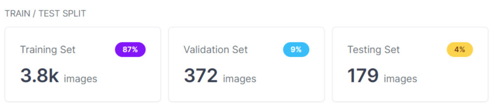
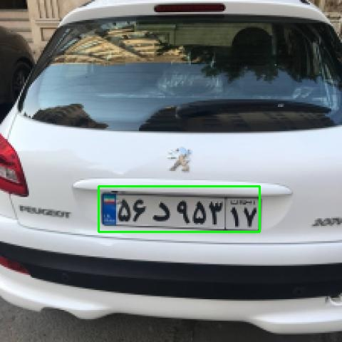
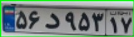

# license_plate_detection
License plate detection based on YoloV7

## Dataset

I combine three following datasets then use it to train the yolov7 model

https://www.kaggle.com/datasets/samyarr/iranvehicleplatedataset

https://www.kaggle.com/datasets/skhalili/iraniancarnumberplate

https://www.kaggle.com/datasets/aslanahmedov/number-plate-detection

Also, I trained another model to classify character and numbers of the plate. I used the following dataset for this task.

https://www.kaggle.com/datasets/sajjadsoroori/iranis

The amount of the data for train, val, and test split is as follows

## Steps of implementing the project

First, I trained a yolo model on the mentioned dataset
Second, I used the trained model to predict on unseen data
Third, get the predicted plate then use ML algorithm to detected characters and numbers of the plate
Forth, crop all the characters and feed it to character classification model to get corresponding character or number

## Results

* results.txt got all the results of training process

The following image is a sample of applying yolo to an image

The cropped plate is as follows:

Prediction of character classification model: 
56
پ
9537
ق

As we see, the model can't predict the character well. The reason could be in the OCR section. The OCR couldn't detect it well. So the cropped character may not have all the character.
